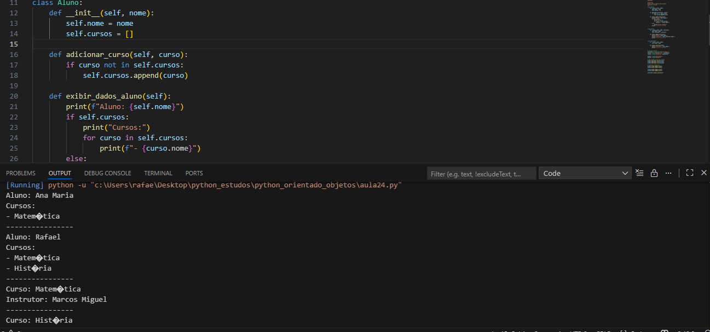

# Sistema de Cursos Orientado a Objetos

## Descrição do Projeto

Este projeto consiste em um sistema de cursos desenvolvido com base nos princípios da Programação Orientada a Objetos (POO). O objetivo é modelar um cenário real de gerenciamento de cursos, alunos e matrículas de forma organizada, reutilizável e de fácil manutenção.

O sistema foi criado com foco educacional, sendo ideal para estudo e prática de conceitos fundamentais de POO.

---

## Objetivos

* Aplicar os conceitos de Programação Orientada a Objetos
* Modelar entidades do mundo real em classes
* Praticar organização e estruturação de código
* Facilitar a manutenção e evolução do sistema

---

## Conceitos de Programação Orientada a Objetos Utilizados

### Classes e Objetos

O sistema utiliza classes para representar entidades como cursos e alunos, permitindo a criação de objetos que encapsulam dados e comportamentos.

### Encapsulamento

Os atributos das classes são protegidos e acessados por meio de métodos, garantindo maior controle sobre os dados e segurança do sistema.

### Organização do Código

Cada classe possui uma responsabilidade bem definida, seguindo boas práticas de desenvolvimento e facilitando a leitura do código.

---

## Estrutura do Projeto

A organização do projeto segue uma divisão lógica por arquivos e classes, tornando o sistema mais compreensível e escalável.

Exemplo de estrutura:

* Classe de Curso: responsável por armazenar e gerenciar informações dos cursos
* Classe de Aluno: responsável pelos dados dos alunos
* Classe principal: responsável por executar e controlar o fluxo do sistema

---

## Tecnologias Utilizadas

* Linguagem de programação orientada a objetos
* Paradigmas de POO

---

## Possíveis Melhorias Futuras

* Implementação de herança para reaproveitamento de código
* Uso de polimorfismo para comportamentos dinâmicos
* Validação de dados de entrada
* Persistência de dados em arquivos ou banco de dados
* Interface gráfica ou interface web

---

## Como Executar o Projeto

1. Clone este repositório
2. Abra o projeto em sua IDE de preferência
3. Execute a classe principal

---

## Referências

* Oracle Documentation – Object-Oriented Programming Concepts
  [https://docs.oracle.com/javase/tutorial/java/concepts/](https://docs.oracle.com/javase/tutorial/java/concepts/)

* Martin Fowler – Single Responsibility Principle
  [https://martinfowler.com/bliki/SingleResponsibilityPrinciple.html](https://martinfowler.com/bliki/SingleResponsibilityPrinciple.html)

* Robert C. Martin – Clean Code
  [https://www.oreilly.com/library/view/clean-code/9780136083238/](https://www.oreilly.com/library/view/clean-code/9780136083238/)

---

Rafaela de Sousa
